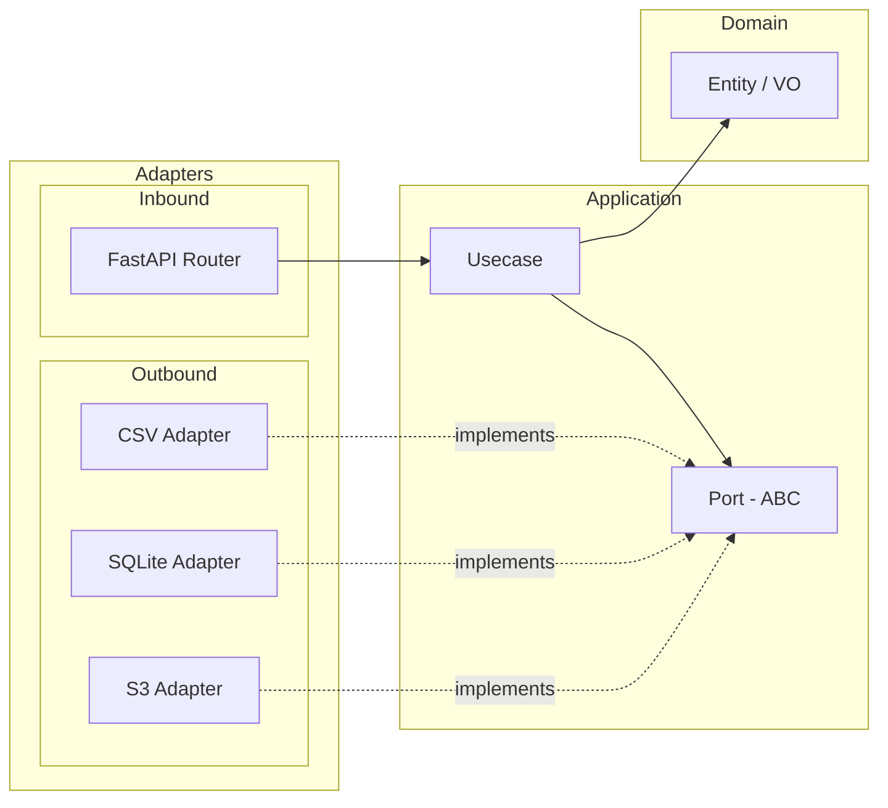

# Hexagonal Architecture ガイド

## 概要

Hexagonal Architecture（Ports and Adapters）は、ビジネスロジックを外部技術（HTTP、DB、ファイルシステム等）から分離するアーキテクチャパターン。

## アーキテクチャ図

Mermaid で以下の図を描く:
- 中心: Domain (Entity / Value Object)
- その外: Application (Usecase / Port)
- 最外: Adapter (Inbound: Router, Outbound: CSV/SQLite/S3)
- 矢印で依存方向を示す（外 → 内）



## 各層の責務

### Domain 層
- **場所**: `src/core/domain/`
- **責務**: Entity, Value Object, ドメインルール（不変条件の検証）
- **依存**: なし（純粋な Python のみ）
- **禁止**: FastAPI, Pydantic BaseModel, HTTP ライブラリ, DB ライブラリ

### Application 層
- **場所**: `src/core/application/`
  - `usecases/`: ユースケース実装
  - `ports/outbound/`: 外部依存の抽象インターフェース（ABC）
- **責務**: ビジネスロジックの実行、port を介した外部アクセス
- **依存**: Domain 層のみ + Port（抽象）
- **禁止**: FastAPI, HTTP ライブラリ, 具体的な Adapter

### Adapter 層
- **場所**: `src/core/adapters/`
  - `inbound/`: FastAPI Router（HTTP → Usecase の変換）
  - `outbound/`: 永続化実装（Port の具象クラス）
- **Inbound の責務**: HTTP リクエスト/レスポンスの変換、例外変換、DI による Usecase 呼び出し
- **Outbound の責務**: Port (ABC) の実装、ブロッキング I/O の非同期化
- **依存**: Application 層 + Domain 層

### Shared 層
- **場所**: `src/core/shared/`
- **責務**: 横断関心事（設定、DI、ロガー、共有例外）
- **注意**: ビジネスロジックを置かない

## 依存ルール

| FROM → TO | Domain | Application | Inbound Adapter | Outbound Adapter | Shared |
|---|---|---|---|---|---|
| **Domain** | — | ❌ | ❌ | ❌ | ❌ |
| **Application (Usecase)** | ✅ | Port のみ | ❌ | ❌ | 例外のみ |
| **Inbound Adapter** | ✅ | ✅ | — | ❌ | ✅ |
| **Outbound Adapter** | ✅ | Port のみ | ❌ | — | ✅ |

## ディレクトリ構成

```
src/
  main.py                    # エントリーポイント
  core/
    domain/                  # Entity / Value Object
    application/
      usecases/              # ユースケース
      ports/outbound/        # 外部依存の抽象 (Repository 等)
    adapters/
      inbound/               # FastAPI Router
      outbound/              # 永続化実装
    shared/                  # 横断関心事
      __init__.py            # 公開シンボルの再エクスポート
      dependencies.py        # DI provider 関数
      exceptions.py          # 共有例外定義
      logger.py              # ロガーユーティリティ
      settings.py            # pydantic-settings 設定
tests/
  unit/
    core/                    # src/core/ と同じ階層構造
```

## 実装順序

新機能を追加する際の標準手順:

1. **Domain**: Entity / Value Object を定義
2. **Port**: 抽象インターフェース（ABC）を定義
3. **Usecase**: ビジネスロジックを実装（port を引数で受け取る）
4. **Outbound Adapter**: 永続化を実装
5. **Inbound Adapter**: Router を追加
6. **DI**: `dependencies.py` に provider を登録
7. **Test**: 各層のユニットテストを作成
